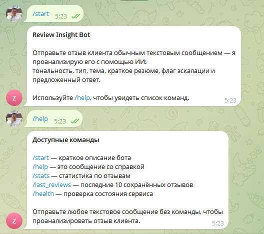
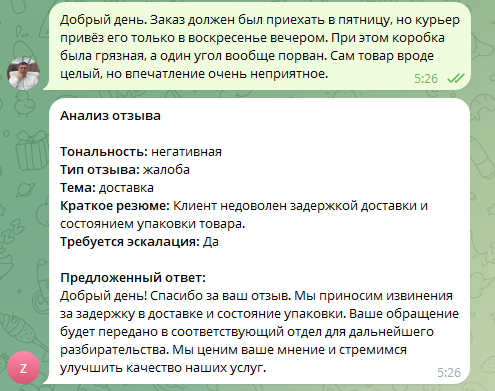
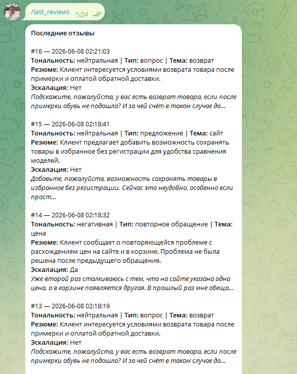
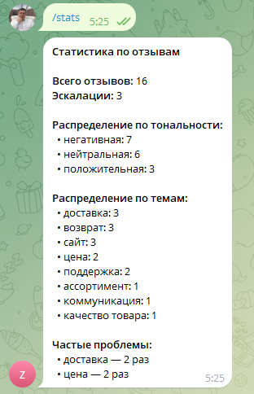

# Telegram Review Insight Bot

Telegram-бот для анализа отзывов клиентов с использованием OpenAI.  
Проект принимает текстовые отзывы, определяет тональность, тип обращения и основную тему, предлагает ответ от имени компании и показывает сводную статистику по сохранённым отзывам.

## Возможности

- Анализ отзывов клиентов в Telegram
- Определение тональности: положительная, нейтральная, негативная, смешанная
- Классификация типа обращения: жалоба, благодарность, вопрос, предложение, повторное обращение
- Определение темы отзыва: доставка, сайт, цена, возврат, поддержка, качество товара и др.
- Генерация рекомендованного ответа от имени компании
- Безопасная обработка вопросов о политике компании без выдуманных правил
- Хранение отзывов и результатов анализа в SQLite
- Команда `/last_reviews` для просмотра последних сохранённых отзывов
- Команда `/stats` для просмотра аналитики по отзывам
- Команда `/health` для проверки состояния сервиса

## Технологии

- Python 3.14
- aiogram 3
- OpenAI API
- SQLite
- Pydantic
- aiosqlite

## Команды бота

- `/start` — краткое описание бота
- `/help` — список доступных команд
- `/stats` — статистика по отзывам
- `/last_reviews` — последние сохранённые отзывы
- `/health` — проверка состояния сервиса

Любое обычное текстовое сообщение без команды обрабатывается как новый отзыв клиента.

## Скриншоты

### Старт и список команд



### Анализ отзыва



### Последние отзывы



### Статистика



## Быстрый запуск

### 1. Клонировать репозиторий

```bash
git clone https://github.com/alexkantemir/telegram-review-insight-bot.git
cd telegram-review-insight-bot
```

### 2. Создать виртуальное окружение

```bash
python -m venv .venv
.venv\Scripts\activate
```

### 3. Установить зависимости

```bash
pip install -r requirements.txt
```

### 4. Создать `.env`

Скопируйте `.env.example` в `.env` и заполните обязательные переменные:

